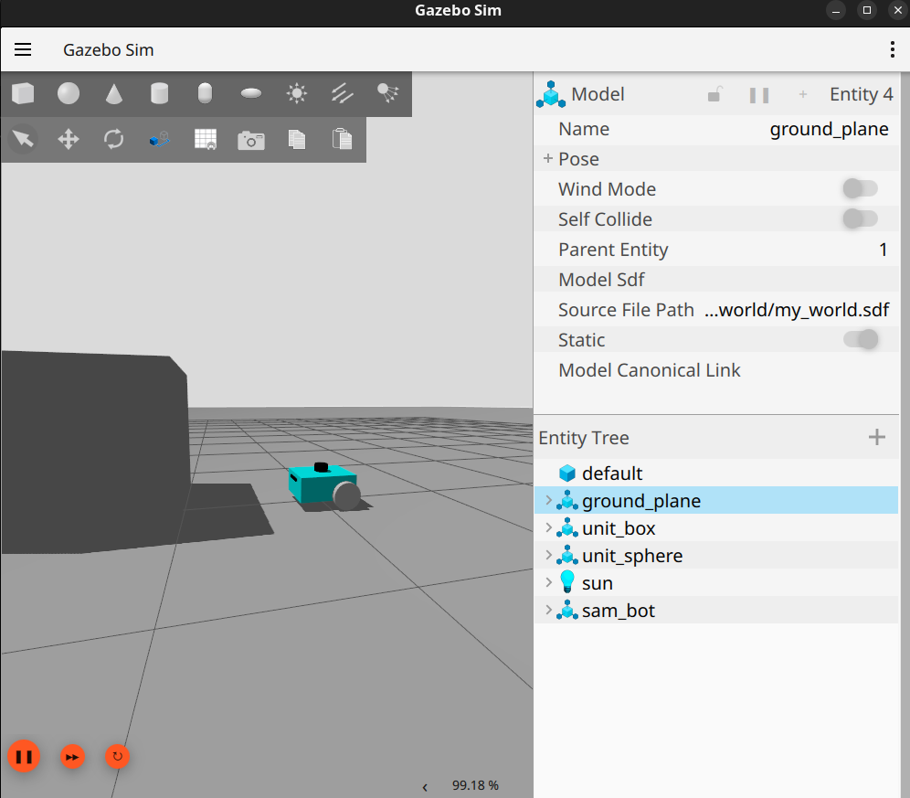

# Gazebo Harmonic — GUI Freeze Caused by gz-transport Discovery Failure

Gazebo Harmonic opens, ghosts, and hangs at "not responding" on a healthy machine with a working NVIDIA driver. This repository documents the root cause — UDP multicast discovery failing on the loopback interface — and a permanent fix.



## Environment

| Component | Version |
|---|---|
| OS | Ubuntu 24.04 LTS |
| ROS 2 | Jazzy Jalisco |
| Gazebo | Harmonic 8.15.0 |
| GPU | NVIDIA GTX 1660 Ti (driver 595.84) |
| Desktop | GNOME / X11 |

## Symptoms

- The Gazebo window opens, then paints a ghosted/frozen frame.
- The window manager reports "not responding"; the process only exits on `SIGKILL`.
- No GPU errors: `dmesg` is clean and the NVIDIA driver loads normally.
- The server process runs fine; only the GUI hangs.

## Diagnosis

The decisive evidence is in the Gazebo log:

```
Waited for 10s for a subscriber to [/gazebo/starting_world] and got none
```

This is not a rendering problem. Gazebo runs the GUI and the physics server as **two separate processes** that find each other over `gz-transport`, which uses **UDP multicast** for discovery. The GUI was never receiving the server's announcement, so it blocked waiting for a peer it could not see.

Two conditions caused this:

1. The loopback interface had multicast disabled and no multicast route, so discovery packets never travelled between the two local processes.
2. The machine has a real NIC (`enp42s0`) on a LAN subnet, and `gz-transport` was binding to it instead of loopback.

### Ruling out the obvious suspects

Before reaching the transport layer, the following were tested and eliminated:

- NVIDIA threaded optimizations
- `QSG_RENDER_LOOP` variations
- GPU driver crash or Xorg fault (`dmesg` clean, driver loaded)

Recording what was **not** the cause matters: it is what separates a real diagnosis from a lucky guess.

## Fix

### Immediate (does not survive reboot)

```bash
sudo ip link set lo multicast on
sudo ip route add 224.0.0.0/4 dev lo
export GZ_IP=127.0.0.1
```

Enabling the multicast flag alone was **not** sufficient — the explicit multicast route on `lo` was also required.

### Permanent

Create `/etc/systemd/system/gz-multicast.service`:

```ini
[Unit]
Description=Enable multicast on loopback for Gazebo/ROS discovery
After=network.target

[Service]
Type=oneshot
ExecStart=/usr/sbin/ip link set lo multicast on
ExecStart=-/usr/sbin/ip route add 224.0.0.0/4 dev lo
RemainAfterExit=yes

[Install]
WantedBy=multi-user.target
```

The leading `-` on the second `ExecStart` tells systemd to ignore a non-zero exit code, since the route may already exist on later boots and would otherwise fail the whole unit.

Enable it:

```bash
sudo systemctl daemon-reload
sudo systemctl enable --now gz-multicast.service
```

Then pin the interface in `~/.bashrc`:

```bash
export GZ_IP=127.0.0.1
```

## Verification

```bash
ip link show lo | grep MULTICAST     # MULTICAST flag present
ip route | grep 224.0.0.0            # route present on lo
gz topic -l                          # topics are listed
```

Gazebo now launches to a rendered 3D scene at a real-time factor of ~99%.

## Why this is easy to misdiagnose

Every symptom points at the GPU: a frozen window, a ghosted frame, a hung renderer. Nothing in the visible behaviour suggests networking. The only signal pointing at the transport layer is a single line in the log, and it is easy to scroll past.

## Used in

This fix was required to bring up the simulation environment in
[rover-ws](https://github.com/hudhayfah2003/rover-ws) — an autonomous
four-wheeled vehicle graduation project.

---

**Author:** Huthaifa Foudeh — Mechanical Engineering, Robotics & Autonomous Systems
